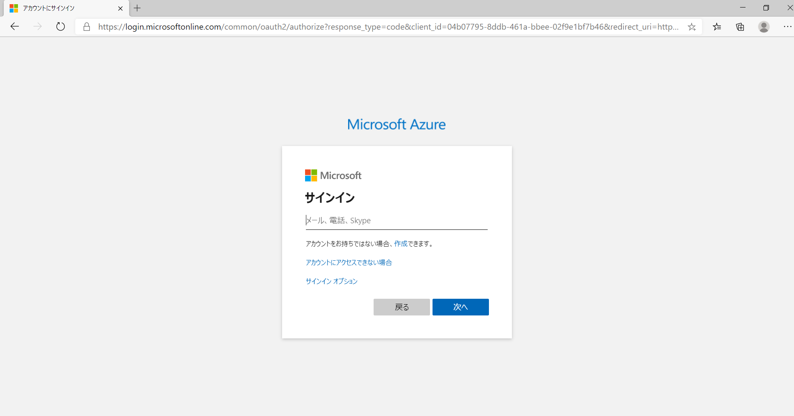
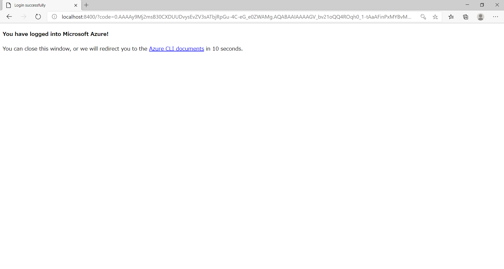

# TerraformからAzure Cloud開発環境の構築

## 必須
- Azure CLI
- terraform

## 前提条件
- [必須](#必須)に記載された内容のアプリケーションがすでにインストール済みであること。
- Azureアカウントを持っていること。

## 事前準備
1. Azure CLIからAzure Cloudへログイン
   ```powershell
   az login
   ```
   コマンドを実行すると、下記のようなSignIn画面が開くのでSignInを行う。
   

   Loginに成功すると下記の画面が表示される。
   

   合わせてConsole上に下記のような認証情報が表示されるので、控えておく。
   ```json
   [
     {
       "cloudName": "AzureCloud",
       "homeTenantId": "XXXXXXXX-XXXX-XXXX-XXXX-XXXXXXXXXXXX",
       "id": "ZZZZZZZZ-ZZZZ-ZZZZ-ZZZZ-ZZZZZZZZZZZZ",
       "isDefault": true,
       "managedByTenants": [],
       "name": "Free Trial",
       "state": "Enabled",
       "tenantId": "XXXXXXXX-XXXX-XXXX-XXXX-XXXXXXXXXXXX",
       "user": {
         "name": "sample@example.com",
         "type": "user"
       }
     }
   ]
   ```

## 使い方
1. **Workspaceの設定**  
   開発系と本番系の2系を設定できる状態にするため、Workspaceの設定を行う。  
   まずは本番系の設定を行う。
   ```sh
   terraform workspace new product
   ```
   次に開発系の設定を行う。
   ```sh
   terraform workspace new develop
   ```
   この順番で設定を行うことで、プロジェクト開始の状態が`develop`になっている。  
   作成が完了すると、`terraform.tfstate.d`が作成されて、指定したWorkspaceもフォルダとして作成される。  
   現在のWorkspaceを確認する場合には、`terraform workspace show`を入力することで確認することができる。

2. **初期化**  
   terraformの初期化を行う。  
   ```sh
   terraform init
   ```

3. **開発系の構成プラン確認**  
   本番系と開発系で設定が分かれているので、まずは開発系の構成プランを確認する。  
   ```sh
   terraform plan -var-file="./.env/terraform.dev.tfvars"
   ```

## コマンド解説
### `terraform plan`